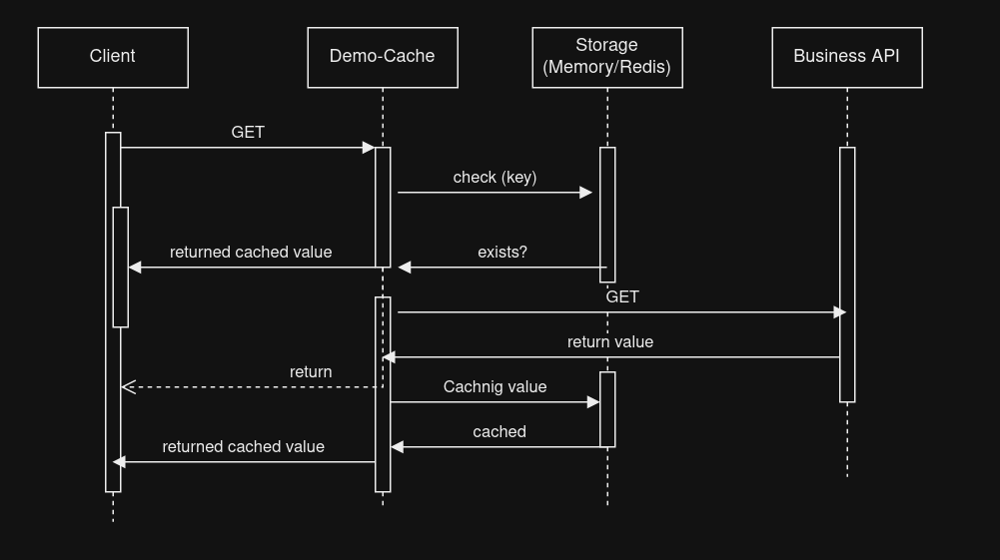

# demo-cache

Aplicação escrita em GO (Golang), que simula um comportamento de uma API de cache para requisições originadas a API principal (business api), atuando como um sidecar.

Escopo é limitado a estudo e conhecimento da linguagem e aplicabilidade de uso em um cenário especifico e direcionado. Tanto que somente foi disponibilizado o método GET, sem considerar váriações como PATH_PARAM, Headers, etc que são utilizados na composição da criação das Keys (Chaves para armazenamento do Storage, este podendo ser em memória ou Redis).

* Fluxo de sequencia 

Foi utilizada a versão 1.16, e abaixo seguem links tanto para instalação, como utilização. 

* Instalação:

    - https://go.dev/doc/install

* Executar:

    Sempre olhar as variavéis definidas em setup.go (pacote -> boostrap), principalmente a SDC_BUSSINES_URL que é a URL da API de negócio, no exemplo visto em no arquivo .vscode/launch.json setei para um mock, assim:
    
    "SDC_BUSSINES_URL":"https://api.mockfly.dev/mocks/52de1e07-4a1e-4711-ad8a-080be7865e5a/sidecar-cache",

    * Logo ajustando as variavéis, e instalando o Go em sua máquina, execute o comando:
        - $ go run main.go     

* Links
 - https://learn.microsoft.com/en-us/azure/architecture/patterns/sidecar
 - https://www.techtarget.com/searchapparchitecture/tip/The-reasons-to-use-or-not-use-sidecars-in-Kubernetes
